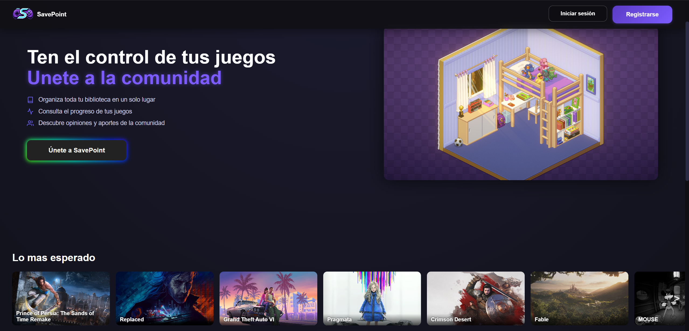
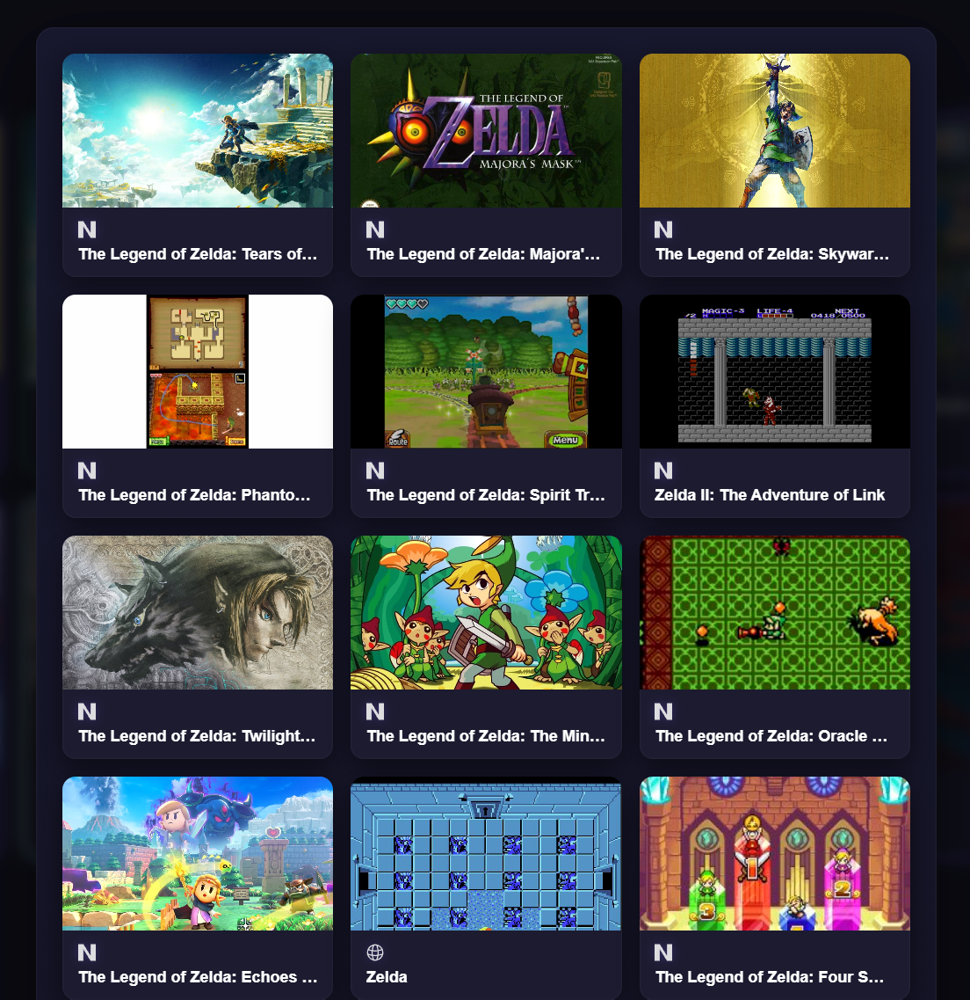
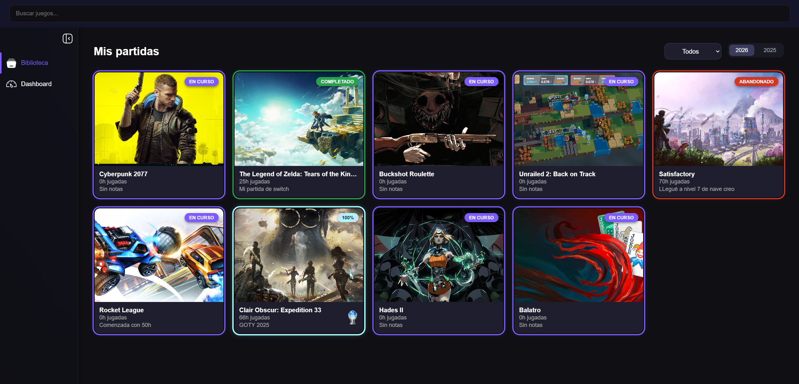
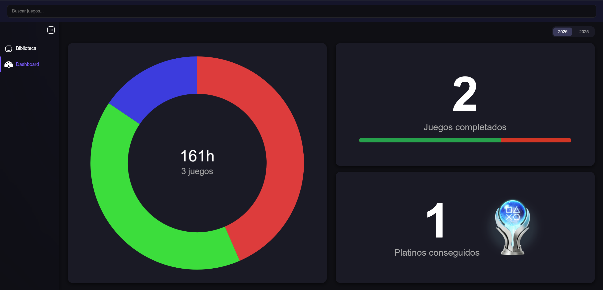

<div align="center">

# 🎮 SavePoint

**Tu tablero personal para videojuegos. Registra, controla y visualiza tu progreso como nunca antes.**

[](https://angular.io/)
[](https://supabase.com/)
[](https://www.typescriptlang.org/)

</div>

---

## ✨ ¿Qué es SavePoint?

**SavePoint** es tu tablero personal para videojuegos. Registra tus partidas, controla horas jugadas, platinos y completados, y visualiza tu progreso anual de manera sencilla e intuitiva.

---

## 🚀 Características

- 🔍 **Búsqueda rápida de juegos** — Encuentra tus títulos favoritos en segundos.
- 🎯 **Seguimiento de partidas personales** — Fecha de inicio/fin, horas jugadas, estado y platinos.
- 📊 **Dashboard anual** — Estadísticas y progreso visual de tus partidas por año.
- 📱 **Interfaz moderna y responsiva** — Funciona en cualquier dispositivo, desde móvil hasta escritorio.

---

## 🎨 Capturas de pantalla

### 🏠 Pantalla principal


### 🔍 Búsqueda de juegos


### 🎮 Detalle de partida


### 📊 Dashboard anual


---

## 🛠️ Tecnologías utilizadas

| Tecnología | Uso |
|---|---|
| **Angular** | Framework frontend — interfaz dinámica y reactiva |
| **Supabase** | Backend as a Service — base de datos y autenticación |
| **TypeScript** | Lenguaje base de la aplicación |
| **HTML / CSS** | Estructura y estilos |

---

## 💡 Contribuciones

¡Las contribuciones son bienvenidas! Sigue estos pasos:

1. Haz un **fork** del repositorio.
2. Crea tu rama:
   ```bash
   git checkout -b feature/nueva-funcionalidad
   ```
3. Realiza tus cambios y haz commit:
   ```bash
   git commit -m "Agrega nueva funcionalidad"
   ```
4. Haz push a tu rama:
   ```bash
   git push origin feature/nueva-funcionalidad
   ```
5. Abre un **Pull Request** describiendo tus cambios.

---

<div align="center">

Hecho con ❤️ para la comunidad gamer · **SavePoint** 🎮

</div>
